# Optimización en Inteligencia Artificial

## 1. ¿Qué significa optimizar?

En Inteligencia Artificial no siempre basta con encontrar **una solución**.

En muchos problemas existen cientos, miles o incluso millones de soluciones posibles. La pregunta importante pasa a ser:

> **¿Cuál de todas esas soluciones es la mejor?**

La **optimización** es el proceso de buscar una solución que maximice o minimice una medida de calidad.

Por ejemplo:

- Encontrar la ruta más corta entre varios lugares.
- Reducir el tiempo necesario para realizar una tarea.
- Minimizar el error de un modelo de Machine Learning.
- Maximizar la puntuación de un agente en un videojuego.
- Encontrar la mejor distribución de horarios.
- Reducir el consumo de energía de un sistema.
- Maximizar la ganancia de una estrategia.
- Encontrar parámetros adecuados para una red neuronal.

En términos generales:

```text
Muchas soluciones posibles
          ↓
      Evaluarlas
          ↓
 Comparar su calidad
          ↓
 Buscar una mejor
          ↓
Encontrar una solución óptima
o suficientemente buena
```

---

## 2. Búsqueda y optimización

Los algoritmos de búsqueda permiten explorar diferentes estados hasta encontrar un objetivo.

Por ejemplo:

- DFS
- BFS
- Dijkstra
- A*

Una forma sencilla de diferenciarlos de la optimización es:

> **Buscar es encontrar una solución. Optimizar es intentar encontrar la mejor solución.**

Sin embargo, ambos conceptos están relacionados. Un algoritmo de optimización también debe explorar diferentes posibilidades.

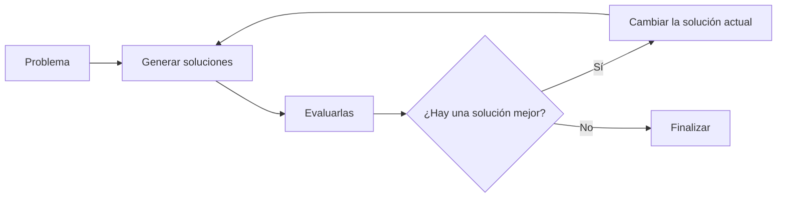

En búsqueda normalmente queremos responder:

> ¿Cómo llego desde un estado inicial hasta una meta?

En optimización queremos responder:

> ¿Qué solución tiene el mejor valor según el objetivo del problema?

---

## 3. Elementos de un problema de optimización

Un problema de optimización normalmente contiene varios elementos.

### 3.1 Solución candidata

Es una posible respuesta al problema.

Por ejemplo, si queremos encontrar el punto más alto de una montaña:

```text
x = 3
```

es una posible solución.

Otra podría ser:

```text
x = 8
```

El algoritmo deberá determinar cuál es mejor.

---

### 3.2 Función objetivo

La **función objetivo** permite medir qué tan buena es una solución.

Supongamos que tenemos:

\[
f(x)=-(x-7)^2+50
\]

Esta función representa la altura de una montaña.

En Python:

```python
def altura(x):
    return -(x - 7)**2 + 50
```

Si evaluamos diferentes posiciones:

```text
x = 0  → altura = 1
x = 1  → altura = 14
x = 2  → altura = 25
x = 3  → altura = 34
x = 4  → altura = 41
x = 5  → altura = 46
x = 6  → altura = 49
x = 7  → altura = 50
x = 8  → altura = 49
```

La mejor posición es:

```text
x = 7
```

porque produce la mayor altura:

```text
50
```

En este problema nuestro objetivo es:

\[
\text{MAXIMIZAR } f(x)
\]

---

## 4. Maximizar y minimizar

Los problemas de optimización suelen tener uno de dos objetivos.

### Maximización

Queremos obtener el valor más grande posible.

Ejemplos:

```text
MAXIMIZAR
├── ganancia
├── puntuación
├── rendimiento
├── precisión
└── fitness
```

### Minimización

Queremos obtener el valor más pequeño posible.

Ejemplos:

```text
MINIMIZAR
├── distancia
├── tiempo
├── costo
├── consumo energético
└── error de un modelo
```

Por ejemplo, durante el entrenamiento de muchos modelos de Machine Learning se busca minimizar una función de error:

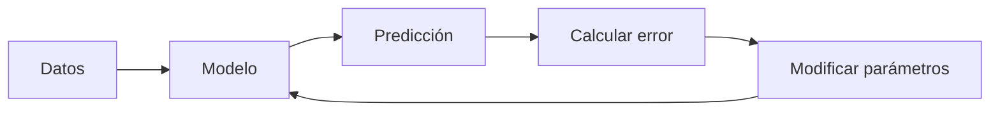

De forma simplificada:

```text
Error inicial = 80
       ↓
Error = 52
       ↓
Error = 31
       ↓
Error = 18
       ↓
Error = 7
```

El sistema está intentando encontrar parámetros que produzcan un error cada vez menor.

Eso también es optimización.

---

# 5. Hill Climbing

## 5.1 La idea

**Hill Climbing**, o ascenso de colina, es un algoritmo de optimización basado en una idea muy sencilla:

> Desde la solución actual, observar soluciones cercanas y moverse hacia una que sea mejor.

Imagine una persona intentando subir una montaña cubierta por niebla.

La persona no puede ver toda la montaña.

Solo puede observar:

- dónde está;
- qué ocurre si se mueve un poco hacia un lado;
- qué ocurre si se mueve hacia el otro.

Entonces utiliza una regla:

> Si una posición cercana es mejor, me muevo hacia ella.

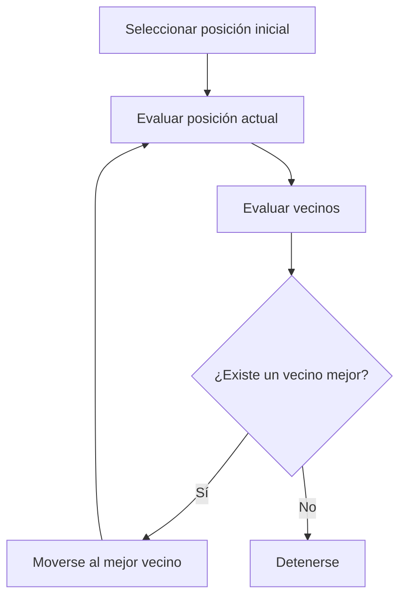

La estrategia recibe el nombre de **Hill Climbing** porque se parece a subir una montaña buscando siempre una posición más alta.

---

# 6. Nuestro primer ejemplo

Utilizaremos esta función:

\[
f(x)=-(x-7)^2+50
\]

En Python:

```python
def altura(x):
    return -(x - 7)**2 + 50
```

Comenzamos en:

```python
posicion = 0
```

El algoritmo debe descubrir por sí mismo hacia dónde moverse.

---

## 6.1 Paso 1

Estamos en:

```text
x = 0
```

Evaluamos:

```python
altura(0)
```

Resultado:

```text
1
```

También evaluamos los vecinos:

```text
izquierda = x - 1
derecha   = x + 1
```

En este caso:

```text
izquierda → x = -1 → altura = -14
actual    → x =  0 → altura =   1
derecha   → x =  1 → altura =  14
```

La derecha es mejor.

Por tanto:

```text
x = 0 → x = 1
```

---

## 6.2 Paso 2

Ahora estamos en:

```text
x = 1
```

Tenemos:

```text
izquierda → x = 0 → altura =  1
actual    → x = 1 → altura = 14
derecha   → x = 2 → altura = 25
```

La derecha vuelve a ser mejor.

Entonces:

```text
x = 1 → x = 2
```

---

## 6.3 El proceso continúa

```text
x = 0 → altura =  1
x = 1 → altura = 14
x = 2 → altura = 25
x = 3 → altura = 34
x = 4 → altura = 41
x = 5 → altura = 46
x = 6 → altura = 49
x = 7 → altura = 50
```

Cuando llegamos a:

```text
x = 7
```

los vecinos son peores:

```text
x = 6 → 49
x = 7 → 50
x = 8 → 49
```

Por tanto:

```text
49 < 50 > 49
```

No existe un vecino mejor.

El algoritmo termina.

---

# 7. Código completo

```python
# =====================
# 1. Funcion objetivo
# =====================
def altura(x):
    return -(x - 7)**2 + 50


# =====================
# 2. Posicion inicial
# =====================
posicion = 0


# =====================
# 3. Hill Climbing
# =====================
while True:

    actual = altura(posicion)

    izquierda = altura(posicion - 1)
    derecha = altura(posicion + 1)

    print(
        f"x={posicion:2} | "
        f"altura={actual:2}"
    )

    # Si la derecha mejora
    if derecha > actual:
        posicion += 1

    # Si la izquierda mejora
    elif izquierda > actual:
        posicion -= 1

    # Ningún vecino mejora
    else:
        break


# =====================
# 4. Resultado
# =====================
print("\n🏆 Mejor solucion encontrada")

print(f"x = {posicion}")
print(f"altura = {altura(posicion)}")
```

Una ejecución produce:

```text
x= 0 | altura= 1
x= 1 | altura=14
x= 2 | altura=25
x= 3 | altura=34
x= 4 | altura=41
x= 5 | altura=46
x= 6 | altura=49
x= 7 | altura=50

🏆 Mejor solucion encontrada
x = 7
altura = 50
```

---

# 8. ¿Dónde está la optimización en el código?

Podemos relacionar cada concepto teórico con una parte del programa.

| Concepto | Código |
|---|---|
| Solución candidata | `posicion` |
| Función objetivo | `altura(x)` |
| Solución actual | `altura(posicion)` |
| Vecino izquierdo | `altura(posicion - 1)` |
| Vecino derecho | `altura(posicion + 1)` |
| Criterio de mejora | `derecha > actual` o `izquierda > actual` |
| Movimiento | `posicion += 1` o `posicion -= 1` |
| Criterio de parada | ningún vecino mejora |

La lógica completa puede resumirse así:

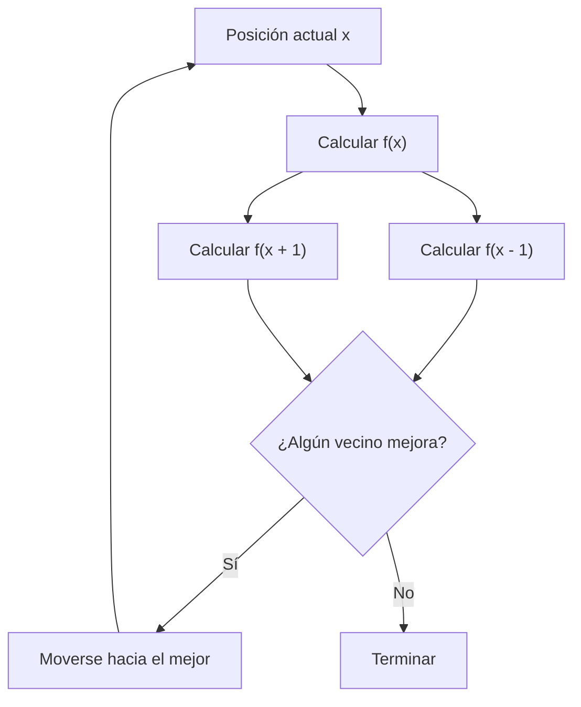

---

# 9. ¿Por qué esto es Inteligencia Artificial?

El algoritmo no recibe directamente la respuesta:

```text
x = 7
```

Lo que recibe es:

1. una forma de representar una solución;
2. una función para medir su calidad;
3. una forma de generar alternativas;
4. una estrategia para decidir qué alternativa tomar.

Es decir:

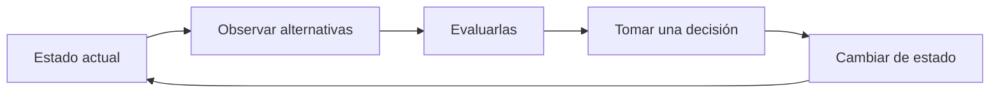

Este patrón aparece constantemente en Inteligencia Artificial:

```text
OBSERVAR
   ↓
EVALUAR
   ↓
DECIDIR
   ↓
ACTUAR
   ↓
VOLVER A EVALUAR
```

---

# 10. Espacio de búsqueda

Aunque el ejemplo tiene una sola variable `x`, debemos imaginar que cada valor posible representa una solución diferente.

```text
...  0   1   2   3   4   5   6   7   8   9  ...
     ↓   ↓   ↓   ↓   ↓   ↓   ↓   ↓   ↓   ↓
     1  14  25  34  41  46  49  50  49  46
```

Todo el conjunto de posibles soluciones se denomina **espacio de búsqueda**.

Hill Climbing no explora necesariamente todo el espacio.

Explora principalmente soluciones cercanas a la solución actual.

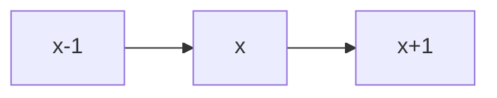

Estas soluciones cercanas reciben el nombre de **vecinos**.

---

# 11. Vecindad

La definición de vecino depende del problema.

En nuestro ejemplo:

```text
posición actual = x

vecinos:
x - 1
x + 1
```

Pero en un tablero podría ser:

```text
     ↑
   arriba

← izquierda  X  derecha →

   abajo
     ↓
```

En una ruta, un vecino podría generarse intercambiando dos ciudades.

En un horario, un vecino podría generarse cambiando una clase de salón.

En un algoritmo genético, la definición de una nueva solución funciona de otra manera.

Por eso una parte fundamental de diseñar un algoritmo de optimización es responder:

> **¿Qué significa que dos soluciones sean vecinas en este problema?**

---

# 12. Paisaje de optimización

Podemos imaginar todas las soluciones como un paisaje.

Las soluciones buenas están en zonas altas si estamos maximizando.

```text
Valor
  ^
  |
  |                  /\
  |                 /  \
  |       /\       /    \
  |      /  \_____/      \
  |_____/________________________> Soluciones
```

Hill Climbing intenta subir ese paisaje.

Pero aparece un problema importante.

---

# 13. Óptimo local

Consideremos esta montaña:

```text
Valor
  ^
  |
60|                           /\
  |                          /  \
  |                         /    \
25|          /\            /
  |         /  \__________/
  |________/________________________> x
```

Existen dos cimas.

Una tiene altura:

```text
25
```

y otra:

```text
60
```

Si empezamos cerca de la primera, Hill Climbing puede subir hasta `25` y detenerse.

¿Por qué?

Porque desde esa posición todos los vecinos inmediatos son peores.

El algoritmo piensa:

> No tengo ningún movimiento que mejore mi situación.

Sin embargo, sabemos que existe una cima mucho mejor.

---

## 13.1 Óptimo local

Una solución es un **óptimo local** cuando es mejor que las soluciones cercanas, pero no necesariamente es la mejor solución de todo el problema.

```text
          óptimo local
               ↓
              /\
             /  \
____________/    \________________
```

---

## 13.2 Óptimo global

El **óptimo global** es la mejor solución de todo el espacio de búsqueda.

```text
                               óptimo global
                                     ↓
                                    /\
                                   /  \
__________________________________/    \
```

La diferencia puede representarse así:

```text
        óptimo local                 óptimo global
             ↓                            ↓
            /\                           /\
           /  \                         /  \
__________/    \_______________________/    \_____
```

---

# 14. Un ejemplo con óptimo local

Podemos modificar nuestra función objetivo y utilizar valores definidos manualmente:

```python
montana = [
    1,
    5,
    10,
    18,
    25,
    20,
    15,
    12,
    20,
    30,
    45,
    60,
    55
]
```

Visualmente:

```text
60 |                              *
   |                            *   *
45 |                         *
   |
30 |                      *
25 |          *
   |        *   *
20 |      *       *     *
15 |                 *
12 |                   *
10 |    *
 5 |  *
 1 |*
   +---------------------------------
    0 1 2 3 4 5 6 7 8 9 10 11 12
```

Si comenzamos en:

```text
x = 0
```

Hill Climbing hará:

```text
1 → 5 → 10 → 18 → 25
```

y se detendrá.

Pero existe una solución mejor:

```text
60
```

Por tanto:

```text
25 = óptimo local
60 = óptimo global
```

Este es uno de los principales problemas de Hill Climbing.

---

# 15. Representación del problema

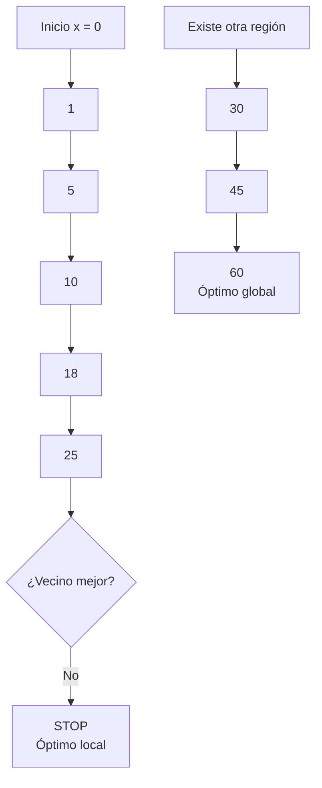

Hill Climbing no conoce automáticamente todo el paisaje.

Sus decisiones se basan en información local.

---

# 16. Ventajas de Hill Climbing

Hill Climbing resulta útil porque:

- es sencillo de implementar;
- requiere poco código;
- puede encontrar soluciones rápidamente;
- no necesita almacenar un árbol completo de búsqueda;
- puede funcionar bien cuando el espacio de soluciones es muy grande;
- permite entender fácilmente el concepto de optimización local.

---

# 17. Limitaciones de Hill Climbing

Su simplicidad también produce problemas.

### Óptimos locales

Puede detenerse en una solución buena pero no globalmente óptima.

### Mesetas

Puede encontrar una región donde muchas soluciones tienen el mismo valor.

```text
        ___________
       /           \
______/
```

En esta situación no es evidente hacia dónde moverse.

### Crestas

Puede existir una dirección de mejora que no sea accesible mediante movimientos simples.

### Dependencia del punto inicial

Dos ejecuciones con diferentes posiciones iniciales pueden producir resultados diferentes.

---

# 18. Una posible mejora: reinicios aleatorios

Una estrategia sencilla consiste en ejecutar Hill Climbing varias veces desde diferentes posiciones iniciales.

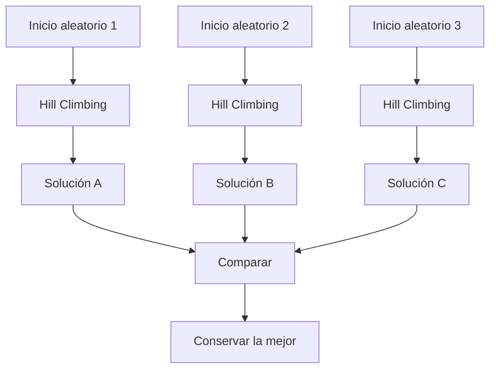

La idea es:

```text
Intento 1 → encuentra 25
Intento 2 → encuentra 60
Intento 3 → encuentra 60
Intento 4 → encuentra 25

Mejor resultado → 60
```

Esto no garantiza siempre encontrar el óptimo global, pero puede mejorar significativamente el resultado.

---

# 19. Hill Climbing como algoritmo

Una versión general puede expresarse mediante pseudocódigo:

```text
crear una solución inicial

REPETIR

    evaluar solución actual

    generar soluciones vecinas

    encontrar el mejor vecino

    SI el vecino es mejor que la solución actual

        movernos al vecino

    SI NO

        detener

FIN
```

En Python, el patrón general sería:

```python
solucion = crear_solucion_inicial()

while True:

    vecinos = generar_vecinos(solucion)

    mejor_vecino = encontrar_mejor(vecinos)

    if evaluar(mejor_vecino) > evaluar(solucion):
        solucion = mejor_vecino

    else:
        break

print(solucion)
```

Observe que esta estructura ya no depende específicamente de una montaña.

Puede adaptarse a diferentes problemas.

---

# 20. Aplicaciones en Inteligencia Artificial

Hill Climbing y otros métodos de optimización pueden utilizarse en problemas como:

### Planificación

Encontrar una organización eficiente de tareas.

### Horarios

Buscar una combinación que reduzca conflictos.

### Rutas

Buscar recorridos con menor distancia o costo.

### Videojuegos

Encontrar comportamientos o estrategias con mayor puntuación.

### Robótica

Buscar movimientos que reduzcan consumo energético o tiempo.

### Selección de características

Buscar subconjuntos de variables útiles para un modelo.

### Machine Learning

Optimizar parámetros o hiperparámetros.

### Inteligencia Artificial Generativa

Muchos modelos modernos dependen de procesos de optimización durante su entrenamiento para ajustar enormes cantidades de parámetros.

---

# 21. Optimización y Machine Learning

Una conexión importante es el entrenamiento de modelos.

Supongamos que una red neuronal produce una predicción incorrecta.

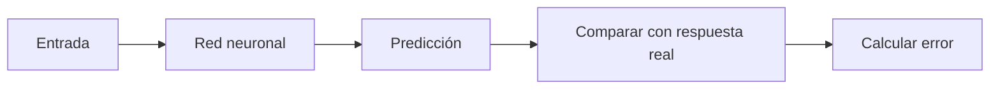

Queremos modificar los parámetros del modelo para reducir ese error.

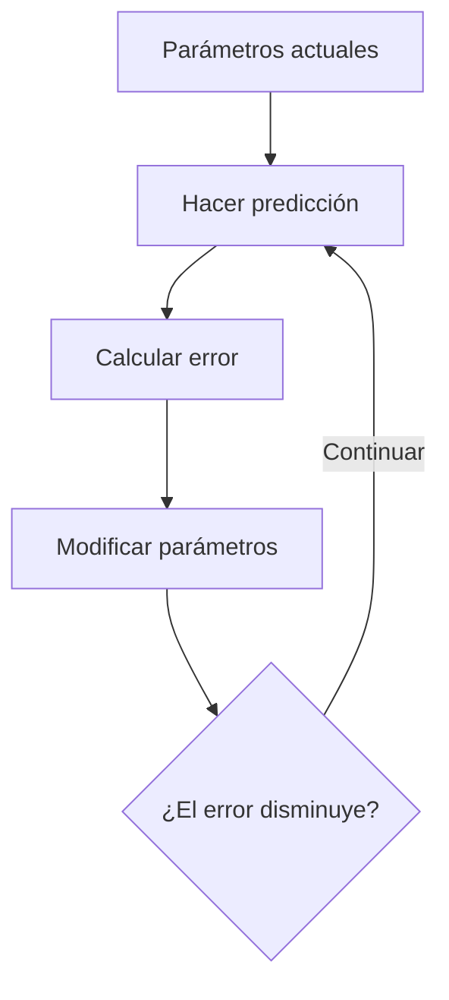

Por tanto, entrenar un modelo puede verse como un problema donde buscamos:

\[
\text{MINIMIZAR ERROR}
\]

Hill Climbing no es necesariamente el algoritmo utilizado para entrenar redes neuronales modernas, pero permite comprender la idea fundamental:

> **Tenemos parámetros, evaluamos qué tan buenos son y buscamos valores mejores.**

Más adelante aparecerán algoritmos como **Gradient Descent**, que aplican esta idea de una manera mucho más adecuada para modelos diferenciables.

---

# 22. Optimización como toma de decisiones

Una forma de entender optimización en IA es:

```text
        ENTORNO
           ↓
      estado actual
           ↓
       ALGORITMO
           ↓
       alternativas
           ↓
        evaluar
           ↓
        decidir
           ↓
         actuar
           ↓
      nuevo estado
```

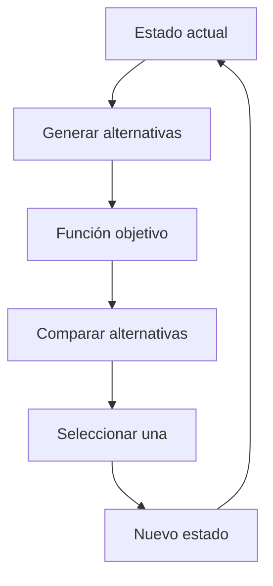

La **función objetivo** es especialmente importante porque representa qué entiende el sistema por una solución "mejor".

---

# 23. La función objetivo define el comportamiento

Supongamos que tenemos un robot de reparto.

Podemos definir:

\[
f = distancia
\]

y pedirle:

```text
MINIMIZAR distancia
```

Probablemente encontrará rutas cortas.

Pero podemos cambiar el objetivo:

\[
f = tiempo
\]

Ahora puede preferir una ruta más larga si permite avanzar más rápido.

También podríamos utilizar:

\[
f = distancia + costo + riesgo
\]

Ahora la decisión depende de varios factores.

Esto permite entender algo importante:

> **Un sistema de IA optimiza aquello que nosotros definimos como objetivo.**

Una función objetivo mal diseñada puede producir soluciones matemáticamente buenas pero poco útiles en el mundo real.

---

# 24. Optimización con varios objetivos

Los problemas reales pueden tener varios criterios.

Por ejemplo, para seleccionar una ruta:

```text
Queremos:

✓ poca distancia
✓ poco tiempo
✓ poco costo
✓ bajo riesgo
```

Estos objetivos pueden entrar en conflicto.

Una ruta puede ser:

```text
Ruta A
Distancia: baja
Costo: alto
Tiempo: bajo
```

Otra:

```text
Ruta B
Distancia: alta
Costo: bajo
Tiempo: medio
```

La optimización en problemas reales muchas veces consiste en encontrar un equilibrio entre varios criterios.

---

# 25. De Hill Climbing hacia otros algoritmos

Hill Climbing introduce una idea poderosa:

```text
solución actual
      ↓
crear alternativas
      ↓
evaluarlas
      ↓
escoger una mejor
      ↓
repetir
```

Sin embargo, el problema de los óptimos locales nos obliga a buscar estrategias más avanzadas.

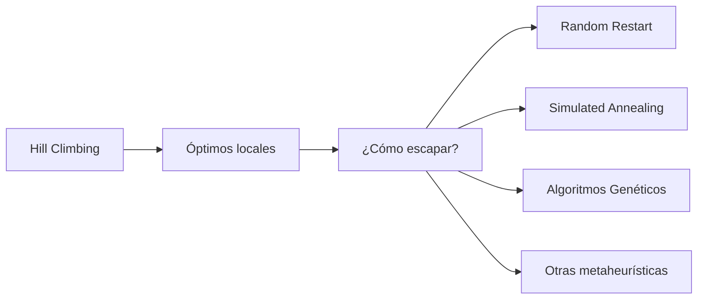

---

# 26. Simulated Annealing

Una idea interesante consiste en permitir temporalmente movimientos peores.

Esto parece extraño:

> ¿Por qué un algoritmo escogería una solución peor?

Porque puede ser necesario bajar de una pequeña montaña para alcanzar posteriormente una montaña más alta.

```text
      óptimo local
           ↓
          /\
         /  \
        /    \                    óptimo global
_______/      \                        ↓
               \                      /\
                \____________________/  \
```

Hill Climbing normalmente se detendría en la primera cima.

Simulated Annealing puede aceptar temporalmente una caída y continuar explorando.

---

# 27. Algoritmos Genéticos

Otra estrategia consiste en mantener muchas soluciones simultáneamente.

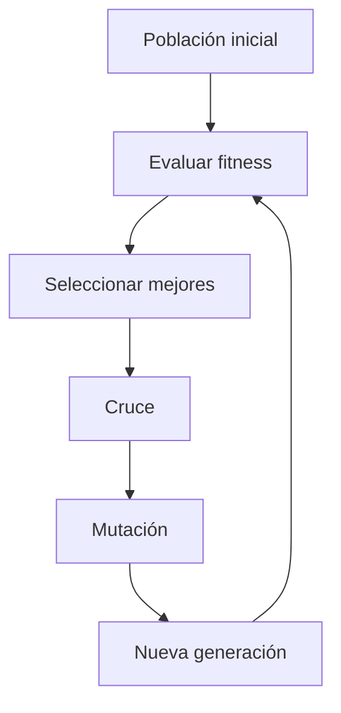

Ejemplo:

```text
Generación 1
A → fitness 20
B → fitness 35
C → fitness 18
D → fitness 40

          ↓

Generación 2
A → fitness 38
B → fitness 44
C → fitness 29
D → fitness 47

          ↓

Generación 3
A → fitness 51
B → fitness 48
C → fitness 56
D → fitness 53
```

En estos algoritmos queremos normalmente:

\[
\text{MAXIMIZAR FITNESS}
\]

---

# 28. Conceptos fundamentales

Al finalizar este tema debemos poder reconocer los siguientes conceptos:

| Concepto | Significado |
|---|---|
| Optimización | Búsqueda de una solución mejor según un objetivo |
| Solución candidata | Una posible respuesta al problema |
| Espacio de búsqueda | Todas las soluciones posibles |
| Función objetivo | Mide la calidad de una solución |
| Maximización | Buscar el mayor valor posible |
| Minimización | Buscar el menor valor posible |
| Vecino | Solución cercana a la solución actual |
| Hill Climbing | Mejora iterativamente utilizando vecinos |
| Óptimo local | Mejor solución de una región cercana |
| Óptimo global | Mejor solución de todo el espacio |
| Criterio de parada | Condición para terminar la búsqueda |

---

# 29. El ciclo de optimización en IA

El concepto central puede resumirse en este ciclo:

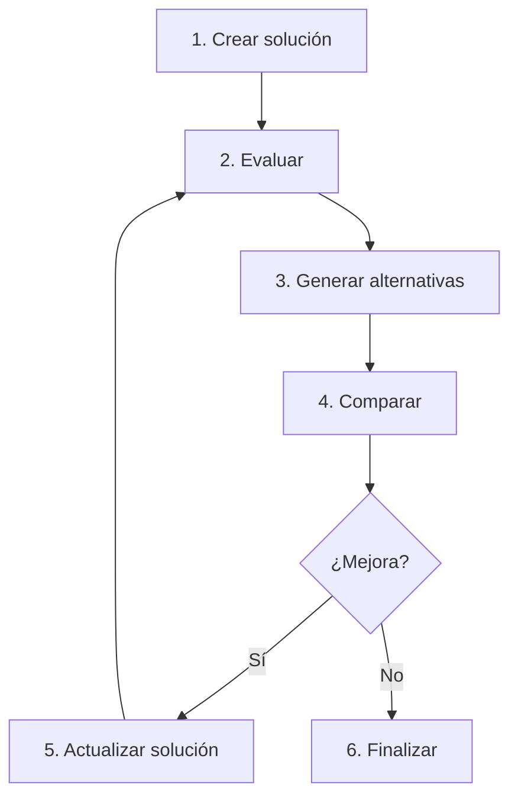

O de forma aún más sencilla:

```text
PROPONER
   ↓
EVALUAR
   ↓
MEJORAR
   ↓
REPETIR
```

---

# 30. Ejercicio de análisis

Considere el siguiente paisaje:

```text
Altura

50 |                        *
45 |                       * *
40 |
35 |        *
30 |       * *
25 |      *   *
20 |     *     *
15 |   **       *       *
10 | **          *    **
 5 |*             ****
   +-----------------------------
    0 1 2 3 4 5 6 7 8 9 10 11
```

Reflexione:

1. ¿Qué ocurriría si Hill Climbing comienza cerca de la primera montaña?
2. ¿Qué ocurriría si comienza cerca de la segunda?
3. ¿El algoritmo garantiza encontrar siempre el óptimo global?
4. ¿Por qué el punto inicial puede cambiar el resultado?
5. ¿Qué estrategia podría utilizarse para mejorar la exploración?

---

# 31. Actividad de programación

Modifique el ejemplo original para que:

1. La posición inicial sea aleatoria.
2. Se muestre en cada iteración:
   - posición actual;
   - altura actual;
   - valor del vecino izquierdo;
   - valor del vecino derecho;
   - decisión tomada.
3. Se cuente cuántos movimientos realizó el algoritmo.
4. Se ejecute Hill Climbing varias veces desde posiciones distintas.
5. Se conserve la mejor solución encontrada.

Una salida podría verse así:

```text
Posición actual: 4
Altura actual:   41

Izquierda: 34
Derecha:   46

Decisión: mover a la derecha →

--------------------------------

Posición actual: 5
Altura actual:   46

Izquierda: 41
Derecha:   49

Decisión: mover a la derecha →

--------------------------------

Posición actual: 7
Altura actual:   50

Izquierda: 49
Derecha:   49

No existe un vecino mejor.

🏆 Resultado:
x = 7
altura = 50
```

---

# 32. Pregunta final

Un algoritmo puede encontrar una solución que parece excelente desde donde está ubicado.

Pero:

> **¿Cómo puede saber que no existe una solución mucho mejor en una región que todavía no ha explorado?**

Esta pregunta conecta Hill Climbing con algoritmos de optimización más avanzados y con uno de los grandes retos de la Inteligencia Artificial:

> **equilibrar explotación y exploración.**

**Explotar** significa aprovechar una región que ya parece buena.

**Explorar** significa arriesgarse a buscar otras regiones que podrían contener soluciones mejores.

Ese equilibrio aparecerá nuevamente en diferentes áreas de Inteligencia Artificial.
